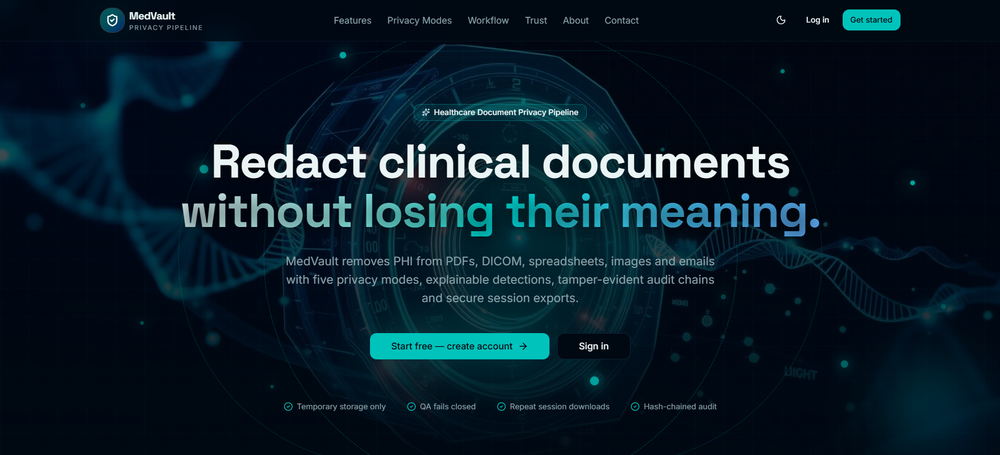
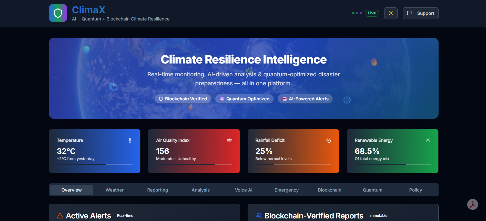
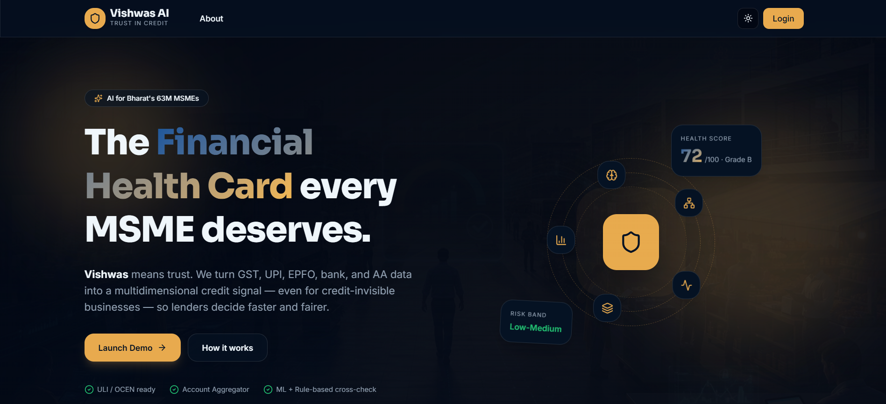

<!-- Animated Header Banner -->

 

<!-- Profile Views & Follower Badges -->

&nbsp;

&nbsp;

&nbsp;

  

<!-- Typing Animation BELOW badges -->

---

## 🌟 About Me

<table>
<tr>
<td width="55%" valign="top">

### 👨‍💻 Who Am I?

🎓 **B.E. Artificial Intelligence & Machine Learning** undergraduate at BNM Institute of Technology, Bengaluru, with a **CGPA of 9.74/10**

🤖 Currently working as an **AI Engineer Intern at Matrix Maven**, building agentic AI workflows using **LangChain & LangGraph**

🏆 **4× National Hackathon Winner** with 5+ Top-10 finishes across intercollegiate competitions, **4 paper publications**, **1 copyright**, and **1 patent filed**

🧠 Driven by an obsession to build **production-grade AI systems** that solve real-world problems at scale

🌱 Currently mastering **LangChain · LangGraph · MLOps** — always pushing to be the sharpest engineer in the room

💡 **Open to:** Exciting AI/ML Opportunities, Research Collaborations & Internships

📍 **Location:** Bengaluru, India 🇮🇳

</td>
<td width="45%" valign="top" align="center">

 

| 📌 | Detail |
|----|--------|
| 📧 | vedantjain273@gmail.com |
| 📱 | +91-9829896609 |
| 🎯 | AI/ML Engineer & Researcher |
| 💼 | Open to Opportunities |

</td>
</tr>
</table>

---

## 🤝 Connect With Me

  

&nbsp;

&nbsp;

&nbsp;

&nbsp;

&nbsp;

&nbsp;

&nbsp;

---

## 💼 Experience

<table>
<tr>
<td width="50%" valign="top">

#### AI Engineer Intern
**Feb 2026 – May 2026**

Enterprise AI · Compliance Intelligence

- 🔷 Built a **Neo4j-powered compliance intelligence platform** mapping ISO 27000, SOC 2, and DORA controls across frameworks.
- 🔷 Developed **agentic LangChain + LangGraph workflows** for evidence processing, discovery, and continuous monitoring.

</td>
<td width="50%" valign="top">

#### Project Intern
**May 2025 – Jul 2025**

MobilityTech · Real-Time Systems

- 🔶 Built a **real-time car-booking platform** with role-based dashboards, live tracking, and instant SMS/email notifications.
- 🔶 Engineered a **FastAPI + MongoDB backend** with driver matching, analytics, and real-time Socket.IO + Leaflet.js updates.

</td>
</tr>
</table>

---

## 🛠️ Tech Stack & Skills

### 💻 Programming Languages

---

### 🤖 AI / Machine Learning

---

### 🌐 Full-Stack & Backend

---

### 🗄️ Databases

---

### ☁️ DevOps, Tools & Platforms

---

### 🧠 Currently Mastering

&nbsp;

&nbsp;

&nbsp;

---

## 🚀 Featured Projects

<table>
<tr>
<td width="33%" valign="top" align="center">

 

#### AI-Driven Healthcare Document Privacy Pipeline

*Privacy-first AI for sensitive healthcare data.*

Redacts 100+ PHI entity types across PDFs, DICOM, and HL7/FHIR.

   

 

</td>
<td width="33%" valign="top" align="center">

 

#### AI-First Disaster Resilience OS

*Predict, prepare, and respond with intelligence.*

IBM Granite LLM, agentic AI, RAG, QAOA, and blockchain with 88% prediction accuracy.

   

 

</td>
<td width="33%" valign="top" align="center">

 

#### Smarter Credit Assessment for MSMEs

*Trustworthy credit intelligence for growing businesses.*

Explainable, alternate-data credit intelligence with role-based workflows.

   

 

</td>
</tr>
</table>

### More Projects

| 🏆 Project | 📝 Description | 🛠️ Stack |
|:-----------|:---------------|:---------|
| **🌊 NavAIgator**    | AI-Powered Maritime Route Optimization using Genetic Algorithms balancing time, fuel & safety | `TypeScript` `Python` `Next.js` |
| **🟢 PulsePoint AI**    | Autonomous project-health intelligence — deterministic RAG scoring, agentic investigation, and executive-ready reports | `FastAPI` `React` `TypeScript` `Mistral AI` `Agentic AI` |
| **🛍️ ReTailor AI**    | Full-stack Generative AI creative engine for the $140B+ retail media market — product photo to validated ad in minutes | `TypeScript` `Python` `Mistral AI` `HuggingFace` |
| **🛡️ SurakshaSetu**    | Privacy-preserving federated UBID platform that resolves fragmented business records with explainable AI | `FastAPI` `Next.js` `MongoDB` `Mistral AI` `HMAC-SHA256` |
| **📚 MargDarshak**    | AI Platform for Education NGOs generating LFA & Theory of Change models with multilingual PDF/Excel/PPT export | `FastAPI` `MongoDB` `TypeScript` |
| **💊 PharmaSight**   | Next-gen pharmaceutical intelligence using deep learning & graph neural networks for drug shortage prediction | `Python` `TypeScript` `GNN` `FastAPI` |
| **🔗 ParkChain Nexus**   | Blockchain-based Smart Parking System with decentralized slot management | `TypeScript` `Blockchain` |
| **🤖 Samadhan AI**   | Smart Employee Support & Ticket Management System powered by AI agents | `Python` `TypeScript` `AI/ML` |
| **🏎️ CarVerse Drive**    | Full-stack gamification engine that turns verified multi-branch dealership milestones into fair, live competition | `FastAPI` `React` `TypeScript` `Three.js` `Mistral AI` |
| **🚁 RescueVision**   | Drone-Based Human & Animal Detection for Disaster Rescue using Computer Vision | `Python` `Computer Vision` `YOLO` |

---

## 📊 GitHub Statistics

 

  

---

## 🏆 Achievements & Certifications

### 🥇 Achievements

| 🏅 | Achievement | 📌 Details |
|----|-------------|-----------|
| 🏆 | **4× National Hackathon Winner** | 5+ Top-10 finishes across intercollegiate competitions |
| 🥈 | **Silver Honour — Eureka Ideathon 2025** | BNMIT × E-Cell IIT Bombay |
| 🔝 | **Top-5 — Mini Anveshna & BIT Ideathon 2025** | Consistent top performer across competitions |
| 🥉 | **3rd Place — National Seminar (World Engineers Day)** | MedVault project — IEI Bengaluru |
| 📄 | **4× Paper Publications** | Published research in reputed international conferences |
| ©️ | **1 Copyright** | Registered intellectual-property contribution |
| 💡 | **1 Patent Filed** | Innovation protected through a filed patent application |
| 🏏 | **State-Level Cricket Finalist** | Led school team; Man of the Match awardee |

 

### 📜 Certifications

-FF0000?style=for-the-badge&logo=comptia&logoColor=white)
&nbsp;

&nbsp;

&nbsp;

 

&nbsp;

&nbsp;

&nbsp;

 

---

## 🎓 Education

<table>
<tr>
<td align="center" width="100%">

 

### 🏛️ BNM Institute of Technology, Bengaluru

 

  

&nbsp;&nbsp;

  

**📚 Relevant Coursework**

| Core CS | AI & ML | Systems |
|:--------:|:--------:|:-------:|
| Data Structures & Algorithms | Machine Learning | Operating Systems |
| DBMS | Deep Learning | Computer Networks |
| Object Oriented Programming | Computer Vision | Cloud Computing |

</td>
</tr>
</table>

---

## 🌱 Leadership & Volunteering

<table>
<tr>
<td align="center" width="33%">

 

🔌 **Joint Secretary**

**IEEE Computational Intelligence Society**

*(BNMIT Chapter)*

 

</td>
<td align="center" width="33%">

 

🤝 **Volunteer**

**NSS & Open Day**

*Project Exhibition*

 

</td>
<td align="center" width="33%">

 

❤️ **Volunteer**

**Connect4Society**

*Community Outreach & Social Impact*

 

</td>
</tr>
</table>

---

## 🎯 A Little More About Me

<table>
<tr>
<td align="center" width="50%">

### ⚡ Interests & Hobbies

| | |
|---|---|
| ⚽ | Football — Represented school at State Level |
| 🏏 | Cricket — State-Level finalist, Man of the Match |
| 🎨 | Drawing & Sketching — Sharpens creative thinking |
| 📖 | Reading AI Research Papers & Tech Blogs |
| 🔭 | Exploring Cutting-Edge AI Developments |

</td>
<td align="center" width="50%">

### 🧠 My Mindset

> *"I don't just want to be good — I want to be the best. Every project, every line of code, every challenge is a step toward mastery."*

 

- 🚀 Constant learner — never satisfied with "good enough"
- 🔬 Research-driven thinker who loves solving hard problems
- 🤝 Collaborator who uplifts teams and communities
- 🎯 Goal: Build AI that genuinely changes lives

</td>
</tr>
</table>

---

## 💡 Quote I Live By

> *"The best way to predict the future is to invent it."*
> **— Alan Kay**

 

<!-- LEARNER Pixel Art Grid -->

---

<!-- Footer Wave -->

**⭐ If you find my work interesting, drop a star! It keeps me motivated 🚀**

